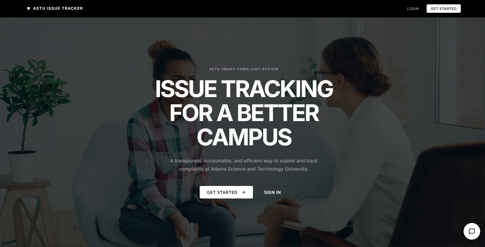
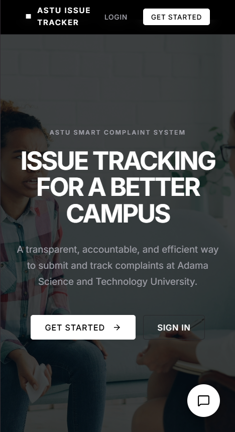
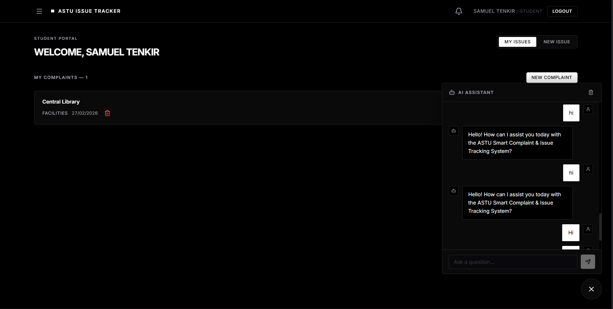

<div align="center">
  <h1>🚀 ASTU Issue Tracker System</h1>
  <p><i>An advanced, full-stack issue tracking platform equipped with an AI-powered RAG Assistant.</i></p>
  
  <p>
    
    
    
    
    
    
    
  </p>
  
  <p><b>This project was created as an entrance project for the ASTU STEM Development Team.</b></p>
</div>

---

## 📖 Project Overview

The **ASTU Issue Tracker** is a comprehensive, production-ready system designed to streamline issue reporting and resolution within an academic environment. It features role-based access control (Student, Staff, Admin), real-time notification components, comprehensive analytics, and an integrated **AI Chatbot** powered by a standalone Retrieval-Augmented Generation (RAG) service.

Whether deployed to the cloud or running locally for development, this architecture is built for scalability, decoupled services, and a seamless user experience.

---

## ✨ Features

- **Role-Based Dashboards**: Tailored interfaces for Students (reporting), Staff (resolving), and Admins (management & oversight).
- **AI RAG Assistant**: A dedicated AI chatbot service capable of answering contextual queries based on user history and dynamic documents.
- **Advanced Analytics**: Visualized metrics tracking issue resolution times, most active categories, and overall system health.
- **Real-Time Notification System**: Keeping users informed on status changes and new assignments.
- **Modern Security**: Implementation of Helmet, CORS, Rate Limiting, and JWT-based authentication.
- **Premium UI/UX**: Built with modern CSS practices, responsive grid layouts, and smooth animations.

---

## 📸 Project Showcase

|Large Screens | Smaller screens | DashBoard | Small Dashboard |
|:---:|:---:|:---:| : --- : |
|  |  |  |  |

---

## 🏗️ Architecture

The system utilizes a modern, microservice-inspired architecture separated into three distinct domains:

1. **Frontend (Client UI)**: A React 19 application built with Vite. Communicates exclusively with the Node.js Backend via REST APIs.
2. **Backend (Main API)**: A Node.js/Express server that handles authentication, database interactions (MongoDB), business logic, and acts as a secure proxy to the RAG service.
3. **RAG Service (AI Engine)**: A separate Python/FastAPI application. It processes natural language queries using AI models and returns intelligent responses.
4. **Database (Storage)**: A MongoDB Atlas cluster serving as the persistent data layer.

**Data Flow Example (Chat Query):**
`Frontend UI` ➔ `Node.js Backend` ➔ `Verify Auth & History` ➔ `Python RAG Service` ➔ `Node.js Backend (SSE)` ➔ `Frontend UI`

---

## 🚀 Deployment Overview

The project is designed for seamless modern cloud deployment:
- **Frontend**: Deployed online via platforms like Vercel or Netlify.
- **Backend (API)**: Deployed on **Render** (Node.js environment).
- **RAG Service**: Deployed on **Render** (Python/FastAPI environment) as an independent web service.
- **Database**: Cloud-hosted via **MongoDB Atlas**.

*(Note: The backend features an automated wake-up mechanism to handle Render's free tier sleep cycles gracefully).*

---

## 💻 How to Run Locally

Follow these step-by-step instructions to set up the entire stack on your local machine.

### Prerequisites
- Node.js (v18+)
- Python (3.9+)
- MongoDB (Local instance or Atlas URI)

### 1. Database Setup
Ensure you have a MongoDB instance running or an active MongoDB Atlas cluster. Retrieve your connection connection URI.

### 2. Backend Setup
Navigate to the `backend` directory, install dependencies, and start the server.
```bash
cd backend
npm install
npm run dev
```

### 3. RAG Service Setup
Navigate to the `rag_service` directory, set up your Python environment, and start the FastAPI server.
```bash
cd rag_service
python -m venv venv
# Activate venv: `source venv/bin/activate` (Mac/Linux) or `venv\Scripts\activate` (Windows)
pip install -r requirements.txt
uvicorn main:app --reload --port 5001
```

### 4. Frontend Setup
Navigate to the `frontend` directory, install dependencies, and spin up the Vite development server.
```bash
cd frontend
npm install
npm run dev
```

---

## 🔐 Environment Variables

You need to configure environment variables for each service. Create a `.env` file in each respective directory.

### Backend (`backend/.env`)
```env
PORT=10000
MONGODB_URI=your_mongodb_connection_string
JWT_SECRET=your_super_secret_jwt_key
FRONTEND_URL=http://localhost:5173
RAG_SERVICE_URL=http://localhost:5001
```

### Frontend (`frontend/.env`)
```env
VITE_API_BASE_URL=http://localhost:10000/api
```

### RAG Service (`rag_service/.env`)
```env
# Add required LLM API keys or embedding configurations here
OPENAI_API_KEY=your_openai_api_key_if_applicable
PORT=5001
```

---

## 📡 API Structure Summary

The Node.js backend exposes several RESTful endpoints. Here is a high-level summary:

- `/api/auth`: User registration, login, and authentication verification.
- `/api/users`: Profile management and user lookups.
- `/api/complaints`: CRUD operations for reporting and tracking issues. Routes are protected by role.
- `/api/admin`: Administrative endpoints (e.g., managing roles, system-wide overrides).
- `/api/analytics`: Aggregation endpoints providing data for dashboard charts and metrics.
- `/api/chat`: Proxy routes to the RAG service, handling SSE (Server-Sent Events) for real-time streaming responses.

---

## 🧠 RAG Integration Explanation

The Retrieval-Augmented Generation (RAG) feature provides users with an intelligent assistant to query policies, past reports, or generalized system help.

1. **Isolation**: The RAG logic (Vector DBs, LLM configurations, chunking) is strictly contained within the Python FastAPI service. 
2. **Security & Proxying**: The frontend **never** talks to the RAG service directly. All chat requests go through the Node.js backend. The Node.js server authenticates the user, retrieves their chat history, attaches it to the payload, and proxies the request to the Python service.
3. **Streaming Responses**: The Python service streams the generated answer block-by-block back to the Node.js backend, which instantly forwards (pipes) those Server-Sent Events (SSE) to the React frontend, providing a ChatGPT-like typing effect.
4. **Resiliency**: The Node.js server includes custom "wake-up" logic to ensure the Python service is active before sending heavy payloads, preventing unwanted timeouts.

---
<div align="center">
  <p>Built with ❤️ by the ASTU STEM Development Team Candidates.</p>
</div>
